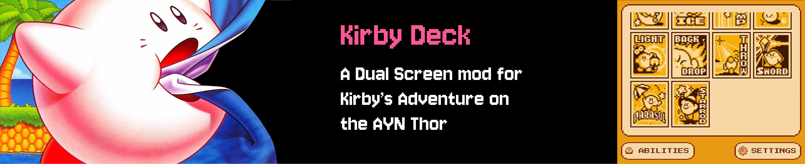
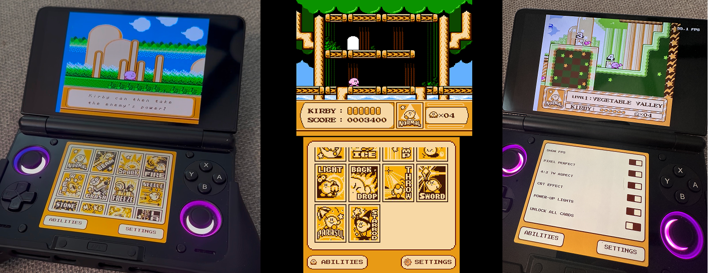
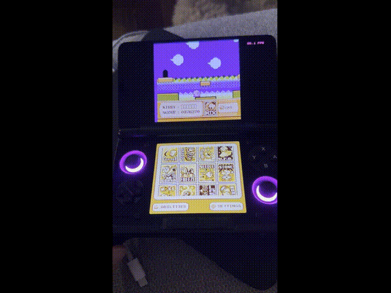

# KirbyDeck

KirbyDeck is a custom dual-screen mod for **Kirby's Adventure on the AYN Thor**.

The original NES game runs on the top screen while the Thor's second screen becomes an interactive ability deck. As Kirby discovers abilities in the game, corresponding cards are unlocked on the bottom screen and can be used to switch powers on the fly.

KirbyDeck also integrates with the Thor's hardware for reactive joystick lighting, haptic feedback, sound effects, and other fun enhancements.

> **KirbyDeck does not include Kirby's Adventure or any Nintendo game data. You must provide your own legally obtained Kirby's Adventure NES ROM.**

---

## Features

**Interactive Ability Deck**  
Kirby's copy abilities become cards on the Thor's bottom screen.

**Discover & Unlock Abilities**  
Ability cards unlock as you encounter powers during normal gameplay.

**Instant Ability Switching**  
Once unlocked, tap an ability card to switch powers.

**Reactive Joystick Lighting**  
The Thor's LEDs change color to match Kirby's current ability, with additional effects for special game states.

**Haptic Feedback**  
Ability changes and interactions use the Thor's built-in vibration.

**Multiple Display Options**  
Choose between pixel-perfect and 4:3 presentation, with optional CRT effects.

**Battery Saves**  
Kirby's Adventure's original battery-backed save system is supported.

**Native Controls**  
Play using the Thor's built-in controls just like a dedicated handheld.

**Built-in RAM Tools**  
A RAM scanner and memory tools are included for anyone who wants to poke around under the hood.

---

## Requirements

You'll need:

- An **AYN Thor** (Other dual screen devices may work but have not been tested)
- The latest **KirbyDeck APK**
- Your own legally obtained **Kirby's Adventure NES ROM**

KirbyDeck was designed specifically around the AYN Thor's dual screens and hardware features. It is not intended as a general-purpose Android NES emulator.

---

## Installation

### Direct APK

1. Open the **Releases** section of this GitHub repository.
2. Open the latest KirbyDeck release.
3. Download the `.apk` file to your AYN Thor.
4. Open the APK on the Thor.
5. Android may ask you to allow installation from your browser or file manager.
6. Install KirbyDeck.

Future versions can be installed over the existing app without removing KirbyDeck first.

**Do not uninstall KirbyDeck just to update it**, as uninstalling an Android app can remove its locally stored data.

### Install with Obtainium

KirbyDeck can also be managed through **Obtainium**, which can install Android apps directly from their release pages and check for future updates.

1. Install Obtainium on your AYN Thor.
2. Open Obtainium and choose **Add App**.
3. Paste this KirbyDeck GitHub repository URL into the source URL field.
4. Obtainium should automatically recognize it as a GitHub source.
5. Add KirbyDeck and install the latest release.

Once added, Obtainium can check this repository for future KirbyDeck releases.

---

## First Launch

When KirbyDeck starts for the first time, you'll be asked to select your **Kirby's Adventure NES ROM**.

Choose the ROM from your device's storage.

KirbyDeck remembers your selection, so you shouldn't need to locate the ROM every time you launch the app.

You can change the selected ROM later from **Settings → Change ROM**.

---

## ROM Compatibility

KirbyDeck does more than emulate Kirby's Adventure. It interacts directly with the game's memory to detect abilities, game states, power-ups, and other events.

Because of this, **ROM version matters**.

KirbyDeck currently supports the ROM versions used during development and testing.

### Currently Supported ROMs

**SHA-256**

`979247b30dc94a8e305b430725376a47d3db265e7ff45b271368c300b493f8c0`,
`3d9850e4e08aaf4c0915109e2021e9590d4b854b14122169021896f69af1d145`,
`34afcebaf04d57a42c2436fb95b933c7841e1621f1dc3be482380baef33ec3d8`

These are US v1, US (rev 1), and EU. If KirbyDeck reports that your ROM is unsupported, your copy may be a different revision or dump.

**Please do not send or upload ROM files when reporting compatibility issues.** A SHA-256 hash is enough to identify the version.

Additional legitimate revisions may be added as they can be tested.

---

## How the Ability Deck Works

At the beginning of the game, most ability cards are locked.

As Kirby encounters and acquires abilities normally, KirbyDeck watches the game and unlocks the corresponding cards.

Once you've discovered an ability, its card remains available.

Tap an unlocked card whenever the ability deck is active to equip that power.

KirbyDeck automatically disables the ability deck during game states where changing Kirby's ability could interfere with the game.

**Normal** is always available, allowing you to drop your current ability.

---

## Joystick Lights

When **Power-Up Lights** are enabled in Settings, the Thor's joystick LEDs react to Kirby's current ability.

Different powers have their own colors, and certain special game states can trigger additional lighting effects.

> The Thor's system-level joystick LED setting must also be enabled for KirbyDeck to control the lights.

---

## Saves

KirbyDeck supports Kirby's Adventure's original battery-backed save data.

Your save is stored by KirbyDeck separately from the ROM itself.

Updating KirbyDeck normally does not require starting over or selecting your ROM again.

As with anything involving game saves, keeping an occasional backup of anything important is never a bad idea.

---

## Settings

KirbyDeck includes options for things like:

- Display mode
- CRT effects
- Power-up lighting
- Vibration
- Cheats

More experiments may appear here in future releases.

---

## Updating

New versions of KirbyDeck will be published through **GitHub Releases**.

If you installed KirbyDeck manually, download the latest APK and install it over your existing version.

If you're using **Obtainium**, it can monitor this repository for new releases and handle the update process for you.

---

## Bugs & Compatibility Reports

Found something weird?

Bug reports are welcome.

When reporting a problem, it helps to include:

- KirbyDeck version
- AYN Thor firmware / Android version if relevant
- Your ROM's SHA-256 hash
- What you were doing when the problem occurred
- Whether the problem happens consistently
- Screenshots or video if they help demonstrate the issue

**Please do not attach or share copyrighted ROM files.**

---

## Disclaimer

KirbyDeck is an unofficial fan-made project.

KirbyDeck is not affiliated with, authorized by, endorsed by, or associated with Nintendo, HAL Laboratory, AYN, or their respective affiliates.

**Kirby's Adventure**, Kirby, and related characters and properties belong to their respective rights holders.

No Nintendo game ROMs or copyrighted game data are included with KirbyDeck.

---

## Changelog

See **CHANGELOG.md** for release history.

---

### Made for the AYN Thor.
